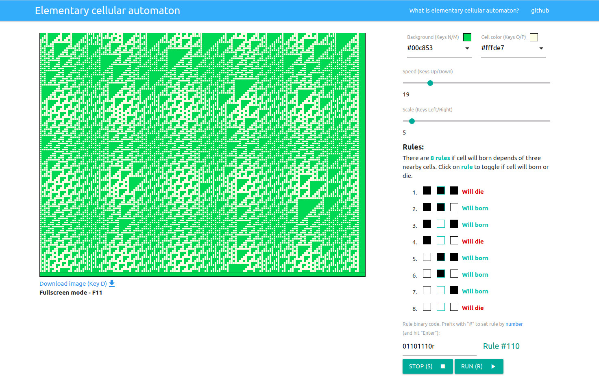

# Single Cellular Automata

Interactive implementation of [Single Cell Automata](https://en.wikipedia.org/wiki/Elementary_cellular_automaton) using AngularJS and Canvas.

> In mathematics and computability theory, an elementary cellular automaton is a one-dimensional cellular automaton where there are two possible states (labeled 0 and 1) and the rule to determine the state of a cell in the next generation depends only on the current state of the cell and its two immediate neighbors. As such it is one of the simplest possible models of computation. Nevertheless, there is an elementary cellular automaton (rule 110, defined below) which is capable of universal computation.
  
Wikipedia

